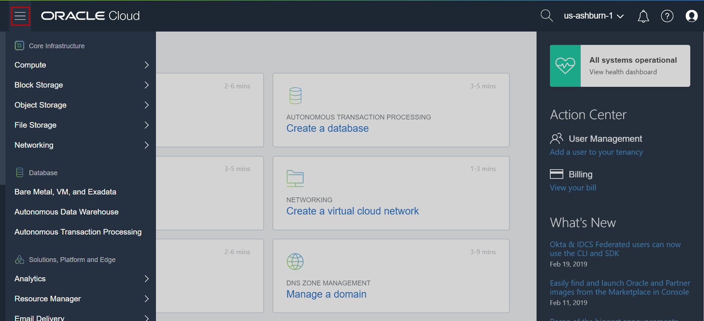
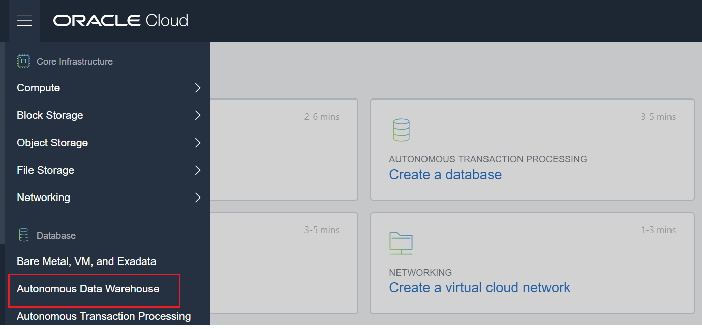
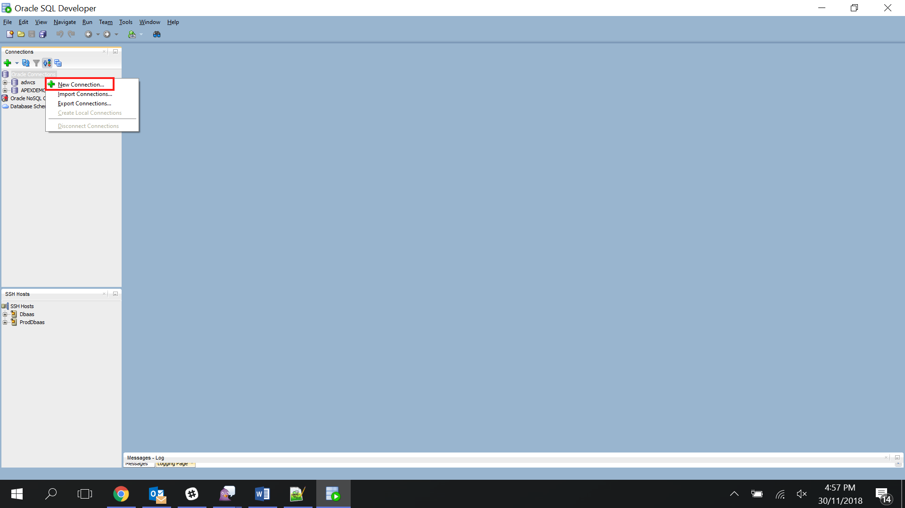
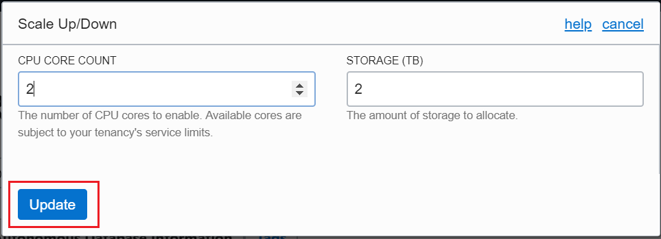
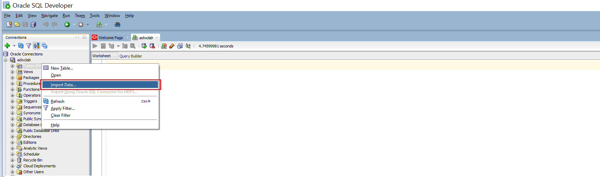
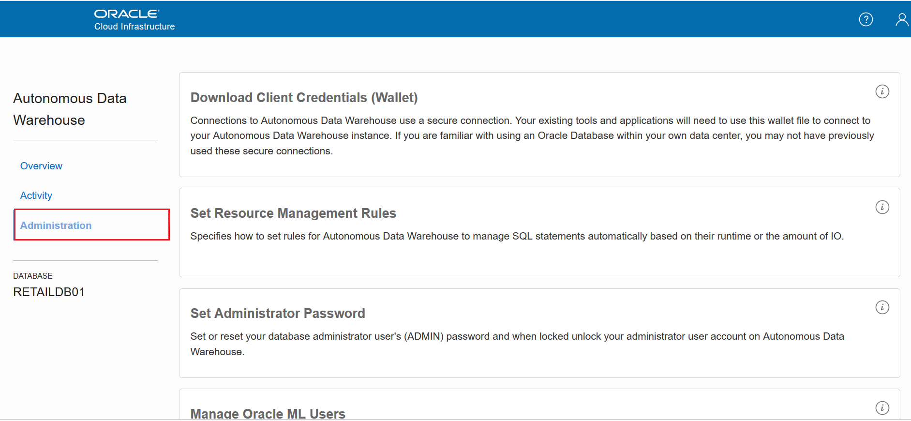
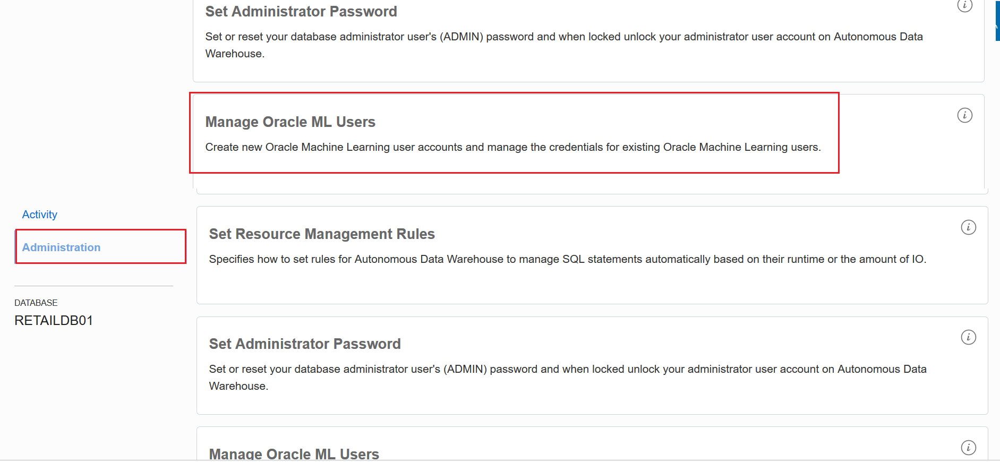

# Lab 100

## Introduction

 Machine learning-infused operational analytics is the key to success in next generation business processes.  The industries with abundant data are leading the way.  Executives need to learn about these breakthroughs in order to make to achieve operational excellence.  Oracle ADW is the disruptive technology that is making this happen.  In this session, we will demonstrate three targeted solutions:  Intelligent Pricing & Customer Lifetime Value for Energy sector, Customer Segmentation & Churn Prediction for Telcos and a novel Dynamic Pricing Model for Retail Stores.  This session will address business processes and the supporting technologies, so invite your data scientists, DBAs, and BI experts.
 
 This lab will show you how to setup the Autonomous Data Warehouse with ML users.

#### What is an Autonomous Data Warehouse?

Oracle Autonomous Data Warehouse is built around the market leading Oracle database and comes with fully automated and fully managed  data warehouse specific features that deliver outstanding query performance.

## Objectives

- Get comfortable with Oracle's public cloud services
- ADW Provisioning
- ADW Connectivity
- Loading Data in ADW instance . 
- Creation of ML (Machine Learning user )

## Trial Account access

Get your trial account in simple steps :

1. Go to <https://cloud.oracle.com> . 
2. Click on "Try for Free" option on the top right of your screen .

   
3. This will route you to below screen .
    
   

4. Give your Email Address and Country and Click on Next button . 
5. Give the required details and click on "Verify Mobile number" . 
   
    
    
 
 6. You will get a security code on your mobile number to verify your 
    mobile number. 
    
    
    
 7. Verify your security code click on "Verify Code" button . 
 8. You will be able to see below screen now . 
 
    
    
 9. Add your card details for 30 days of free trial and you will ready                         with your account . You will get your account details with password in separate mail . 
   

Read on to begin your Getting Started journey with Oracle Autonomous Data Warehouse.

### **STEP 1**: Lab Prerequisites – Required Software
- Oracle Cloud Account
- Sql Developer 

  **Oracle SQL Developer** is an Integrated development environment for working with SQL in Oracle databases. Oracle Corporation provides this product free . You can download this from below link :
  <https://www.oracle.com/technetwork/developer-tools/sql-developer/downloads/index.html>

### **STEP 2**: Access the Cloud

- Navigate to https://cloud.oracle.com

- Enter your tenancy name and click continue.

   

- Click Next to go in login page and then enter username/password

   

- Click top left menu to see all available service.

   

### **STEP 3**: ADW Provisioning

- Click on the Menu Icon to show the available services. In the list of available services, select Autonomous Data Warehouse.

- The console for Autonomous Data Warehouse displays. You can use the List Scope drop-down menu to select a compartment. Click Create Autonomous Data Warehouse.

  

- In the Create Autonomous Data Warehouse dialog, enter the following information.
  * Display Name - Enter a name for the data warehouse for display   (eg. adwapexdemo).
  * Database Name - Use letters and numbers only, starting with a letter (eg. adwapexdemo). Maximum length is 14 characters. (Underscores not initially supported.)
  * CPU Core Count - Number of CPUs for your service.(Minimum to be 5)
  * Storage (TB) - Select your storage capacity in terabytes. It is the actual space available to your service instance, including system-related space allocations.(Minimum to be 1 TB)
  * Administrator Credentials - Password for ADMIN user of the service instance. The password must meet the following requirements:
  * The password must be between 12 and 30 characters long and must include at least one uppercase letter, one lowercase letter, and one numeric character.
      * The password cannot contain the username.
      * The password cannot contain the double quote (") character.
      * The password must be different from the last 4 passwords used.
      * The password must not be the same password that is set less than 24 hours ago.
  * License Type - Select whether you have existing licenses or if you want to subscribe to new database software licenses and the database cloud service.
  * Tags - (Optional) Tagging is a metadata system that allows you to organize and track resources within your tenancy. Tags are composed of keys and values which can be attached to resources.
  * Click Create Autonomous Data Warehouse.
  
  
  
- The Create Autonomous Data Warehouse dialog closes. On the console, the State field indicates that the data warehouse is Provisioning. Once creation is completed, the State field changes from Provisioning to Available.
 
 
- Download the Credentials Zip File. Once you have created the data warehouse, download the credentials zip file for client access to that data warehouse. Click newly created instance and then select DB Connection.
- The Database Connection dialog opens for downloading client credentials. Click Download.
- In the Download Wallet dialog, enter an encryption password (BEstrO0ng_#11) for the wallet, confirm the password, and then click Download.
 
- Click Save File, and then click OK.
- Store the zip file and make note of the password. You will use the zip file in the next step to define a SQL Developer connection to your Autonomous Data Warehouse database.
-	Open SQL Developer on your local computer. In the Connections panel, right-click Connections and select New Connection.
 
- The New/Select Database Connection dialog appears. Enter the following information.
  * Connection Name - Enter the name for this cloud connection.
  * Username - Enter the database username. Use the default administrator database account (admin) that is provided as part of the service.
  * Password - Enter the admin user's password that you or your Autonomous Data Warehouse administrator specified when creating the service instance.
  * Connection Type - Select Cloud Wallet.
  * Configuration File - Click Browse, and select the Client Credentials zip file, downloaded from the Autonomous Data Warehouse service console by you, or given to you by your Autonomous Data Warehouse administrator.
  * Service - In the drop-down menu, service selections are prepended with database names. Select the low, medium, high, or parallel menu item for your database. These service levels map to the LOW, MEDIUM, HIGH, and PARALLEL consumer groups, which provide different levels of priority for your session.
 Note: Earlier versions of SQL Developer may not support this feature.             
 
-	Click Test.
Status: Success displays at the left-most bottom of the New/Select Database Connection dialog.
- Click Connect to connect to your ADW instance . 

### **STEP 4** : ADW Scaling 

- To Scale Up or Scale Down your ADW instance, Go to your ADW instance in your console . 

- Click on Scale Up/Down tab . 

 

- Once you click on this tab, you will be able to see below screen . 

 

- Increase or decrease the count as per your requirement and Click on " Update" to update the count . 

### **STEP 5** :  Data Loading

- To load data in your ADW instance, identify the file which you want to load . 
- In our case , we have "bigml_marketbasket" csv file in our local machine which we want to load in our ADW instance . 
- Go to your Sql Developer (which is already connected to your ADW instance) .
- On your right hand side , you will be able to "Tables" option . 
- Right click on "Tables" option and Select "Import" option . 

- Once you click on "Import" button , you will be able to see below window . 

 

- Click on Browse option and Browse the file from Local machine which you want to upload to ADW instance . 
- Give ";" in Line Terminator field and modify other fields as per your requirement . 
- Click on "Next" button . 
- Once you click on "Next" button, you will be able to see below screen . 

 

- Give desired table name and click on "Next" button . 
- Select the columns which you want to import and click on "Next" button . 
 

- Click Next

 

- You will be able to see below screen. 

 

- Check the summary and click on "Finish" button to Finish the data load process .
- You will be able to see loaded data in your ADW instance now  . 

### **STEP 6** : Creation of ML User

- To create ML(Machine Learning User), go to your ADW instance and click on "Service Console"

 
 
- Click on "Administration" Tab 

  
  
- Click on "Manage Oracle ML User "
  
  
  
- This will route you to the Machine Learning console and you will be able to see list of ML users created (if any) for your ADW instance . 
- Click on "Create" button to create new ML user . 

  

- Give Username , Email Address  and password.

- Click on "Create" button on the top right side of your console to create ML user .

