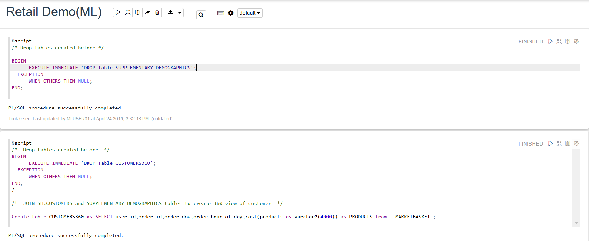
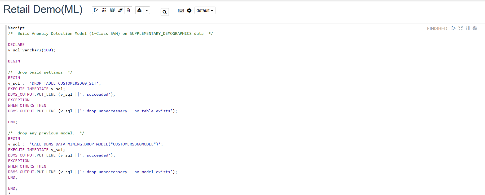
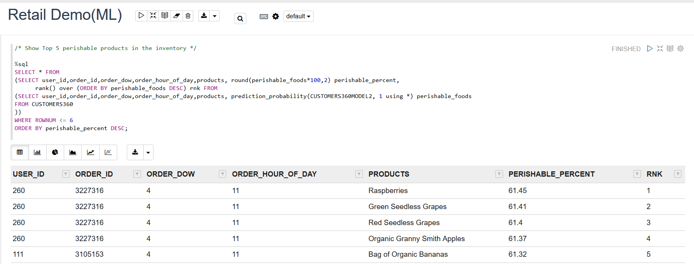
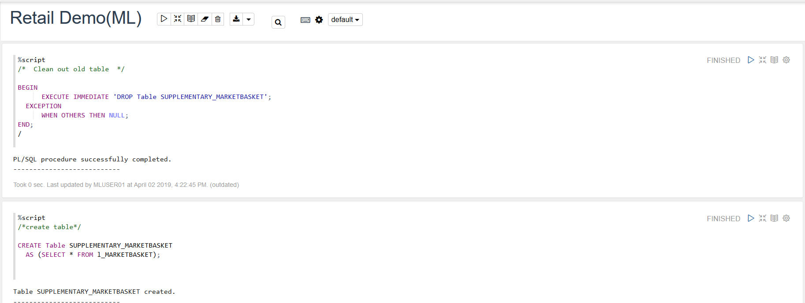
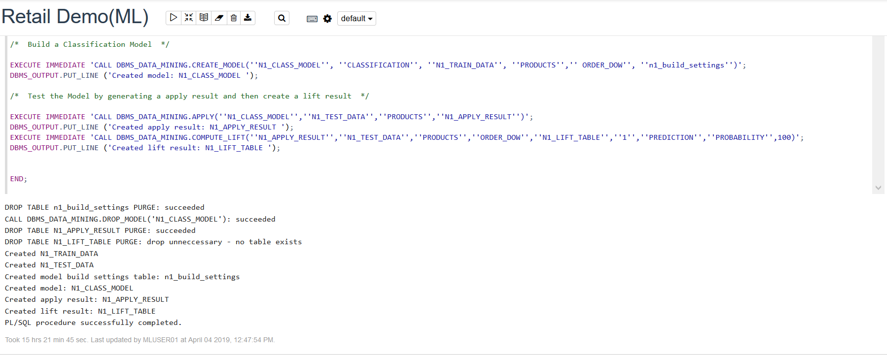
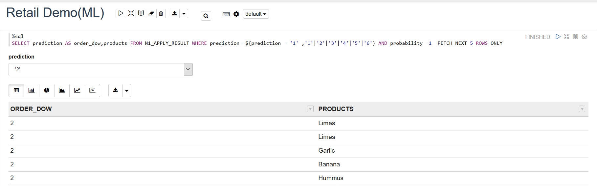
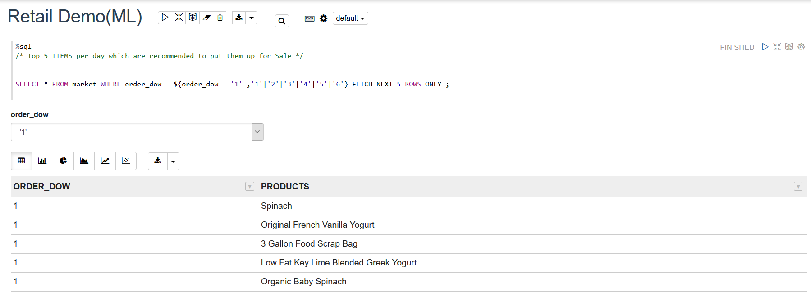

# Lab 200
 

## Introduction

### Before you begin
#### Purpose
The purpose of this document is to analyze the data present in autonomous data warehouse cloud and run the in-built machine learning algorithms in autonomous data warehouse Cloud.

Time to Complete
Approximately 30 minutes.

Topics covered in this document

**1. Getting Started with Oracle Machine Learning**

**2. Data Analysis in ADWC**

**3. Machine Learning Capabilities of ADWC**

## Getting Started with Oracle Machine Learning

#### Background

Oracle Machine Learning provides a notebook style application designed for advanced SQL users and provides interactive data analysis that lets you develop, document, share, and automate reports based on sophisticated analytics and data models. 

#### Required Artifacts
Before starting this instruction, you should:
-	Have successfully completed LabGuide100.

### **STEP 1**: Data Analysis in ADWC

- Log in to your Oracle Machine Learning account with the link obtained in LabGuide100.

   Click on Notebooks in the home page.
   

- In the Notebooks page, click on Create.

   Create Notebook dialog opens up. Provide the name of the notebook as RetailDemo(Analysis). The notebook opens in the Notebook editor.

- In order to find the top 5 products being sold, enter the following sql statement in the first paragraph in the notebook editor-

        SELECT COUNT(PRODUCTS) AS PRODUCT_COUNT,PRODUCTS FROM l_marketbasket GROUP BY PRODUCTS ORDER BY COUNT(PRODUCTS) DESC FETCH NEXT 5 ROWS ONLY 

   Click run icon in the first paragraph as shown in the screenshot.
   

- After the statement runs successfully, Oracle Machine Learning fetches the relevant data from the database and displays it in a tabular format. 
   In order to visualize the data in graphical output, click the bar icon for bar graphical representation.
   Click on settings and drag and drop the fields as shown in the screen-shot in the respective field boxes.
   
            | KEYS       | VALUES           |     
            |----------  |----------------  |
            | PRODUCTS   | PRODUCTS_COUNT   |     
            |            |                  |     
            |            |                  |     
            |            |                  |    

   The output visualization graph will be obtained as shown in the screenshot below.

-  Same as previous two steps 
   Enter the following sql statement in the second paragraph in the notebook editor-

        SELECT COUNT(PRODUCTS),ORDER_HOUR_OF_DAY,ORDER_DOW,ORDER_NOW FROM L_MARKETBASKET GROUP BY ORDER_DOW,ORDER_NOW,ORDER_HOUR_OF_DAY ORDER BY ORDER_DOW; 

    Click run icon in the first paragraph as shown in the screenshot.

   In order to visualize the data in graphical output, click the bar icon for bar graphical representation.
   Click on settings and drag and drop the fields as shown in the screen-shot in the respective field boxes.
       
            | KEYS       | GROUPS           | VALUES          |  
            |----------  |----------------  |-----------------|
            | ORDER_NOW  | ORDER_HOUR_OF_DAY| COUNT(PRODUCTS) |    
            |            |                  |                 |
            |            |                  |                 |
            |            |                  |                 |
       

   The output visualization graph will be obtained as shown in the screenshot below.
   

-  Same as previous two steps 
   Enter the following sql statement in the next paragraph in the notebook editor. 

        SELECT COUNT(ORDER_ID),ORDER_HOUR_OF_DAY FROM L_MARKETBASKET GROUP BY ORDER_HOUR_OF_DAY ;
   Click run icon in the first paragraph as shown in the screenshot.

   In order to visualize the data in graphical output, click the scatter-chart icon for bar graphical representation as shown in the screenshot.
   Click on settings and drag and drop the fields as shown in the screen-shot in the respective field boxes.
   
            | xAxis              | yAxis            |          
            |----------          |----------------  |
            | ORDER_HOUR_OF_DAY  | COUNT(ORDER_ID)  |                 
            |                    |                  |                 
            |                    |                  |                 
            |                    |                  |                 
       

   The output visualization graph will be obtained as shown in the screenshot below.
   

-  Same as the first two steps.
   In order to find the sales trend for each product in each day, enter the following sql statement in the fourth paragraph in the notebook editor-

        SELECT COUNT(PRODUCTS) AS NO,ORDER_NOW,PRODUCTS FROM L_MARKETBASKET WHERE PRODUCTS IN('BANANA','ORGANIC GARLIC','LIME','SEEDLESS RED GRAPES', 'ORGANIC LEMON') GROUP BY ORDER_NOW,PRODUCTS ORDER BY NO DESC FETCH NEXT 100 ROWS ONLY ;
   Click run icon in the first paragraph as shown in the screenshot.

   In order to visualize the data in graphical output, click the area-chart icon for bar graphical representation as shown in the screenshot.
   Click on settings and drag and drop the fields as shown in the screen-shot in the respective field boxes.
       
           
            | KEYS       | GROUPS           | VALUES          |  
            |----------  |----------------  |-----------------|
            | PRODUCTS   | ORDER_NOW        | NO_SUM |    
            |            |                  |                 |
            |            |                  |                 |
            |            |                  |                 |
       

   The output visualization graph will be obtained as shown in the screenshot below.
   

### **STEP 2**:  Machine learning in ADWC

- The first Machine learning model will help in deducing what are the chances of a particular Product in the inventory getting Perished.

- Start the model by dropping off the previous tables which will be used in building the models.
Once the tables are dropped create the CUSTOMERS360 table which contains the featured information from the original l_marketbasket table.

- Once the tables has been dropped the previous models as well as their settings has to be dropped.

- Next the requisite algorithm and the corresponding parameters has to be imported in order to build the model. In this scenario Algorithm used is 'Support Vector Machines'. Explicitly the tables its corresponding featured column, on which the algorithm is applied, has to be mentioned. Based on all this informations the model is created.

- Once the model has been built , in order to find the top 5 perishable Product enter the following SQL command in a new paragraph of the notebook

- The most perishable product in a particular day of the week can be found out using the following SQL command 

- The Second model is built with Classification algorithm, tells us which products have the least probability of a sale. 

First step is to drop any pre configured table or settings

- Then we start off with building the classification model and then generate a lift test and an apply test result

- The apply test result will give the products and with the least chances of them getting sold that particular day of the week .

- Combining both prediction results and one can come up with a list of products that should be offered as a flash sale or similar promotional activities. 

