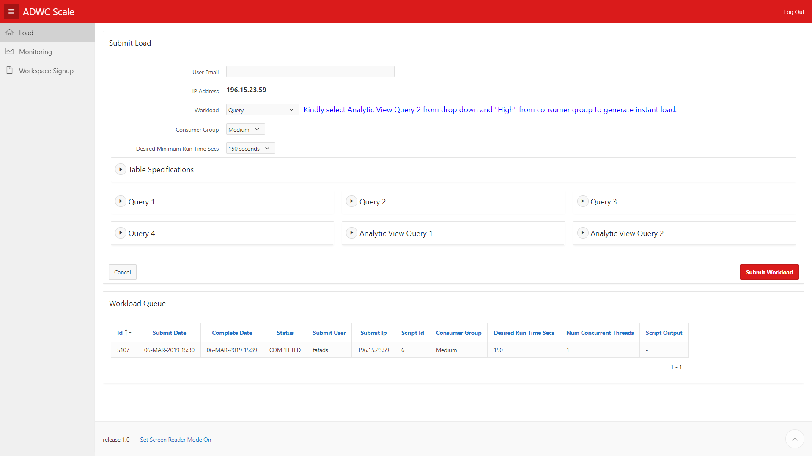

# Lab 100

## Introduction

This lab will show you how to navigate the Autonomous Data Warehouse auto scaling demo.

## Objectives

- Get comfortable with Autonomous Data Warehouse auto scaling and cost saving feature

## Autonomous Data Warehouse auto scaling click through demo

### **STEP 1**: ADW Scaling Demo Navigation

- Open browser and Navigate to http:www.oracledatagroup.com. it will show below landing page

- Click **Load** Menu to submit load to Autonomous Data Warehouse

  
- In load page click **Submit Instant Workload** to submit quick load
   
    
   
- In load page enter below information
  
  * User Email - Enter your Email id
  * Workload - Select query from workload drop down 
  * Consumer Group - Select consumer group(Low, Medium, High) under which you want to submit load
  * Desired Minimum Run time sec - Select for how many second you want to run query
  * Click Submit Workload.It navigates to Monitoring screen.
  
    
  
- In Monitoring screen you can see below information which you can monitor.
  * ADWC CPU Utilization% - CPU utilization after load submission
  * Elastic Last 24 Hour oCPU Cost - Last 24 CPU cost after auto scaling
  * Static Last Hour 24 oCPU Cost - Static CPU cost if we don't auto scale ADW. 
  * Current OCPU Count    - CPU count after scaling up/down
  * CPU Provisioned Count - Maximum CPU Count for ADW instance
  * Scaling Job Status    - Scaling Job status based on load on ADW Instance
  * ADWC CPUs Provisioned - CPU count after scaling up/down
  * 
  
  
  
- Below is the ADW console screen where you can see CPU core count up/down based on Scaling Job
  

