# Lab 200

## Introduction

This lab will show you how to setup the Autonomous Data Warehouse and configure auto scaling for your instance.

## Objectives

- Get comfortable with Oracle's public cloud services

- ADWCS Provisioning

- DBaaS Provisioning

- APEX and ORDS Installation

- Auto Scaling Demo Installation

- Manage and Monitor an ADW instance

- Auto Scale up/down an ADW instance

## Notional Architecture and Trial Account access

### **STEP 1**: Review Notional Architecture
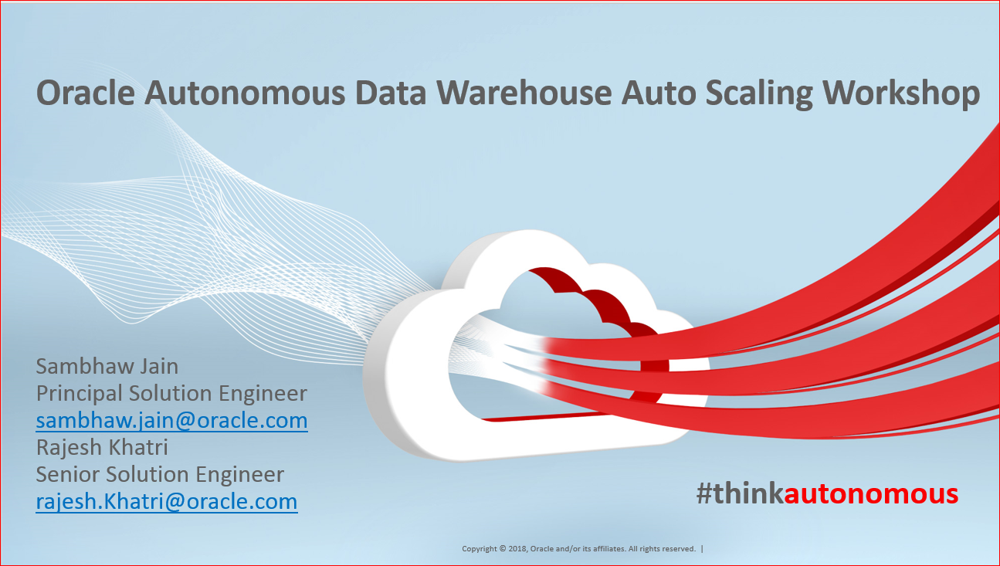


#### What is an Autonomous Data Warehouse?

Oracle Autonomous Data Warehouse is built around the market leading Oracle database and comes with fully automated data warehouse specific features that deliver outstanding query performance.  This environment is delivered as a fully managed cloud service running on optimized high-end Oracle hardware systems.  You don’t need to spend time thinking about how you should store your data, when or how to back it up or how to tune your queries.  

We take care of everything for you.

Click here to <a href="https://www.youtube.com/watch?v=tZMZODoi2xw" target="blank">watch our short video</a> that explains the key features in Oracle's Autonomous Data Warehouse.

Oracle’s Autonomous Data Warehouse is the perfect quick-start service for fast data loading and sophisticated data reporting and analysis.  Oracle manages everything for you so you can focus on your data.

Read on to begin your Getting Started journey with Oracle Autonomous Data Warehouse.


### **STEP 2**: Lab Prerequisites – Required Software
- Oracle APEX Release 18.2.0.00.12
- Oracle REST Data Services 18.4

<a href="https://cloudcustomerconnect.oracle.com/resources/32a53f8587/summary" target="blank">**Cloud Customer Connect**</a> Forum for Autonomous Data Warehouse
If you have a question during this workshop then use the Autonomous Data Warehouse Forum to post questions, connect with experts, and share your thoughts and ideas about Oracle Autonomous Data Warehouse.

Are you are completely new to the <a href="https://cloudcustomerconnect.oracle.com/resources/32a53f8587/summary" target="blank">**Cloud Customer Connect**</a> forums? Visit our  <a href="https://cloudcustomerconnect.oracle.com/pages/1f00b02b84" target="blank">Getting Started forum page</a> to learn how to best leverage community resources.


### **STEP 3**: Access the Cloud

- Navigate to https://console.us-ashburn-1.oraclecloud.com
Note : Change region name(us-ashburn-1) in above URl

- Enter your tenancy name and click continue.

   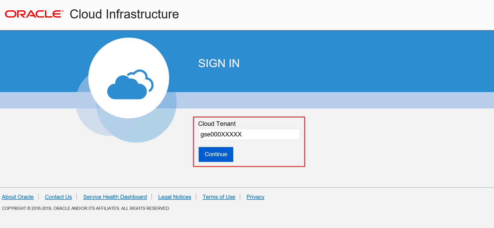

- Click continue to go in login page and then enter username/password

   

   

- Click top left menu to see all available service.

   

## ADWCS and DBaaS Provisioning

### **STEP 4**: ADWCS Provisioning

- Login to cloud environment,Click on the Menu Icon to show the available services. In the list of available services, select Autonomous Data Warehouse.

- The console for Autonomous Data Warehouse displays. You can use the List Scope drop-down menu to select a compartment; in this example the gse000#### (root) compartment is selected. Click Create Autonomous Data Warehouse.

  

- In the Create Autonomous Data Warehouse dialog, enter the following information.
  * Display Name - Enter a name for the data warehouse for display   (eg. adwapexdemo).
  * Database Name - Use letters and numbers only, starting with a letter (eg. adwapexdemo). Maximum length is 14 characters. (Underscores not initially supported.)
  * CPU Core Count - Number of CPUs for your service.(Minimum to be 5)
  * Storage (TB) - Select your storage capacity in terabytes. It is the actual space available to your service instance, including system-related space allocations.(Minimum to be 1 TB)
  * Administrator Credentials - Password (BEstrO0ng_#11) for ADMIN user of the service instance. The password must meet the following requirements:
  * The password must be between 12 and 30 characters long and must include at least one uppercase letter, one lowercase letter, and one numeric character.
      * The password cannot contain the username.
      * The password cannot contain the double quote (") character.
      * The password must be different from the last 4 passwords used.
      * The password must not be the same password that is set less than 24 hours ago.
  * License Type - Select whether you have existing licenses or if you want to subscribe to new database software licenses and the database cloud service.
  * Tags - (Optional) Tagging is a metadata system that allows you to organize and track resources within your tenancy. Tags are composed of keys and values which can be attached to resources.
  * Click Create Autonomous Data Warehouse.
  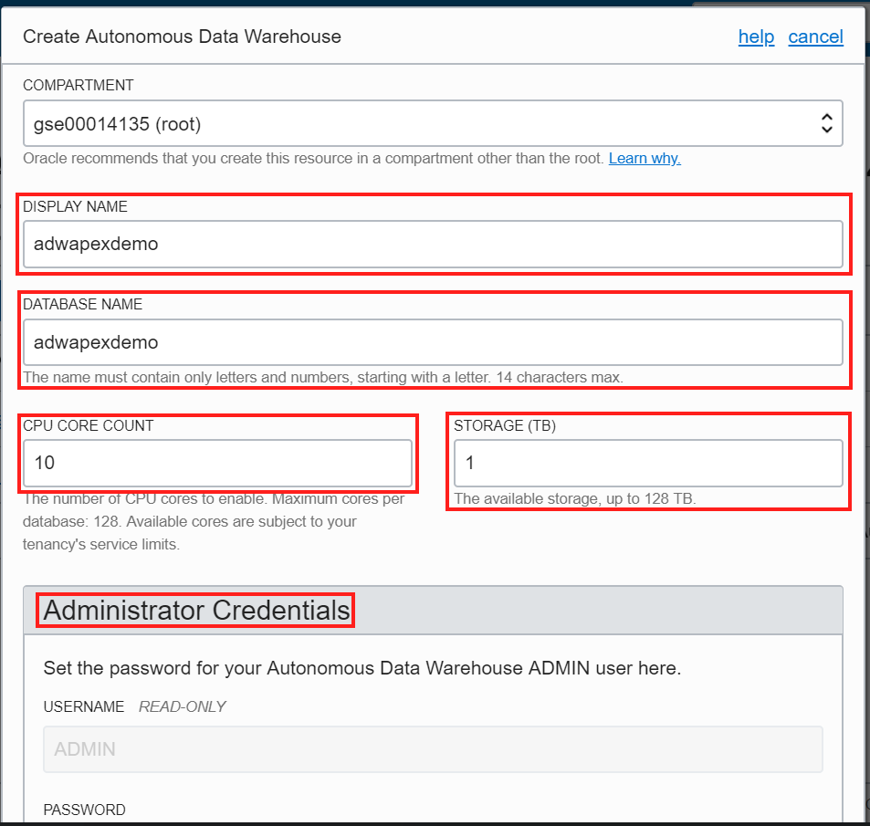
  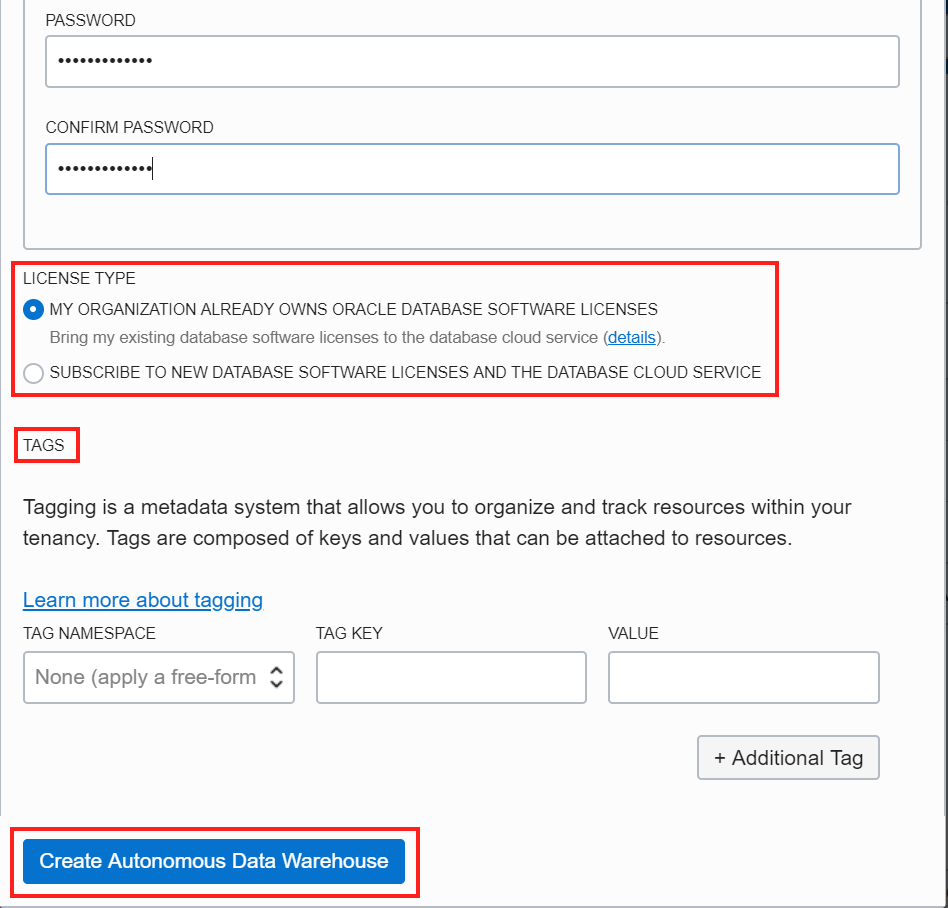
- The Create Autonomous Data Warehouse dialog closes. On the console, the State field indicates that the data warehouse is Provisioning. Once creation is completed, the State field changes from Provisioning to Available.
 
 
- Download the Credentials Zip File. Once you have created the data warehouse, download the credentials zip file for client access to that data warehouse. Click newly created instance and then select DB Connection.
- The Database Connection dialog opens for downloading client credentials. Click Download.
 
- In the Download Wallet dialog, enter an encryption password (BEstrO0ng_#11) for the wallet, confirm the password, and then click Download.
 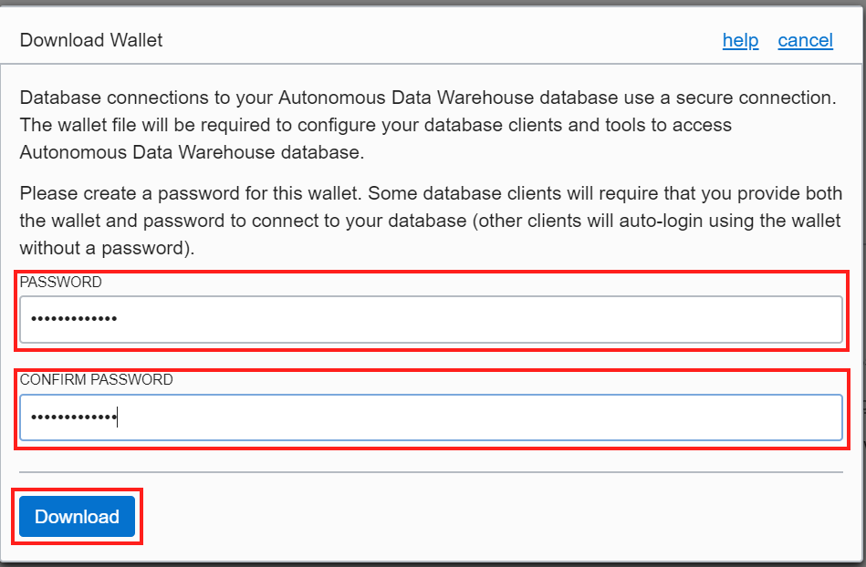
- Click Save File, and then click OK.
- Store the zip file and make note of the password. You will use the zip file in the next step to define a SQL Developer connection to your Autonomous Data Warehouse database.
-	Open SQL Developer on your local computer. In the Connections panel, right-click Connections and select New Connection.
 
- The New/Select Database Connection dialog appears. Enter the following information.
  * Connection Name - Enter the name for this cloud connection.
  * Username - Enter the database username. Use the default administrator database account (admin) that is provided as part of the service.
  * Password - Enter the admin user's password that you or your Autonomous Data Warehouse administrator specified when creating the service instance.
  * Connection Type - Select Cloud Wallet.
  * Configuration File - Click Browse, and select the Client Credentials zip file, downloaded from the Autonomous Data Warehouse service console by you, or given to you by your Autonomous Data Warehouse administrator.
  * Service - In the drop-down menu, service selections are prepended with database names. Select the low, medium, high, or parallel menu item for your database. These service levels map to the LOW, MEDIUM, HIGH, and PARALLEL consumer groups, which provide different levels of priority for your session.
 Note: Earlier versions of SQL Developer may not support this feature.             
 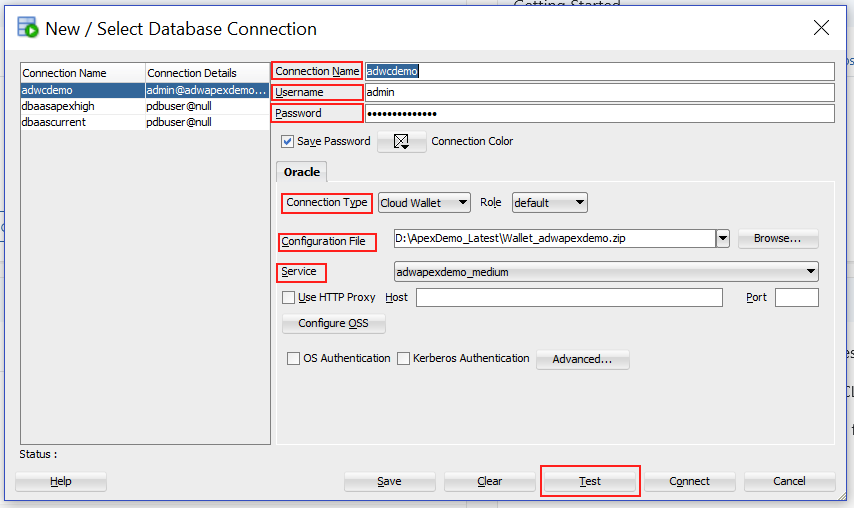
-	Click Test.
Status: Success displays at the left-most bottom of the New/Select Database Connection dialog.

### **STEP 5**: DBaaS Provisioning

To create database you first need to create VCN (Virtual Cloud Network) if you have already created VCN then you can skip 1-5 steps.

- Open the navigation menu. Under Core Infrastructure,go to Networking and click Virtual Cloud Networks.

 

- Choose a compartment you have permission to work in (on the left side of the page). The page updates to display only the resources in that compartment. If you're not sure which compartment to use, contact an administrator
- Click Create Virtual Cloud Network

  [](./images/dbaas2.png)

- Enter the following:
  * Create in Compartment: Leave as is.
  * Name: A friendly name for the cloud network. It doesn't have to be unique, and it cannot be changed later in the Console (but you can change it with the API). Avoid entering confidential information.
  *	Create Virtual Cloud Network Plus Related Resources: Make sure this radio button is selected.

  
  
  

- Click Create Virtual Cloud Network and then click close.

 

- Modify Security list for your VCN.
  * Click **apexvcn** which you have created, on left side menu you can see Security List as below.

  

  * Click Security List and then click "Default Security List for apexvcn"
  * Now click **Edit All Rules** button and add ingress rule for your VCN to allow public internet to 8080 and 1521 as below

  

- Generating an SSH Key Pair Using PuTTY Key Generator : When you define your Oracle DBaaS database instance, you will need to provide a secure shell (SSH) public key to establish secure connections. Perform the following steps to generate an SSH key pair using the PuTTY Key Generator on Windows.
  * Find puttygen.exe in the PuTTY folder on your computer, for example,        **C:\Program Files (x86)\PuTTY. Double-click puttygen.exe** to open it.

 

  * Accept the default key type, RSA.
  * Set the Number of bits in a generated key to 2048 bits, if it is not already set with that value.
  * Click Generate.
  * Move your mouse around the blank area to generate randomness to the key.

  

  * The generated key appears under Public key for pasting into OpenSSH authorized_keys file. Copy public key in notepad we will need this while creating Dbaas provisioning.

  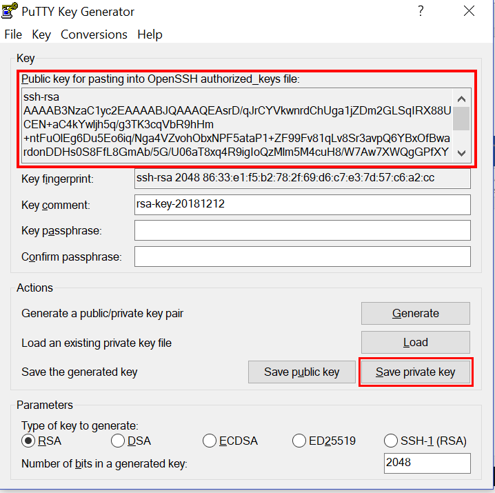

  * To save the key in the PuTTY PPK format, click Save private key to save the private key of the key pair.
- Login to cloud environment, Click Services to show the available   services. In the list of available services, under Database select Baremetal ,VM and Exadata

  

- The console for Database displays. You can use the List Scope drop-down menu to select a compartment; in this example the gse00014135 (root) compartment is selected. Click Launch DB System.
- In the Create Launch DB System dialog, enter the following information:
  * Display Name - Enter a name of the database.
  * Select Availability Domain
  * Select Shape Type
  * Select Shape
  * Select Oracle Database Software Edition – Enterprise Edition
  * Select Availability Storage Type – 256
  * Leave Licence Included Selected
  * Paste SSH public which we copied in earlier step
  * Select Virtual Cloud Network (VCN which we created earlier)
  * Select Client Subnet
  * Give Hostname Prefix (Eg. apexdemo)
  * Give Database Name (APEXDB)
  * Give Database Version -12.1.0.2
  * Give PDB name (pdb1)
  * Give Database Admin Password (BEstrO0ng_#11): The password must meet the following requirements:
The password must be between 12 and 30 characters long and must include at least one uppercase letter, one lowercase letter, and one numeric character.
  * The password cannot contain the username.
  * The password cannot contain the double quote (") character.
  * The password must be different from the last 4 passwords used.
  * The password must not be the same password that is set less than 24 hours ago.
  * Select Automatic Backup
  * Click Launch DB System

  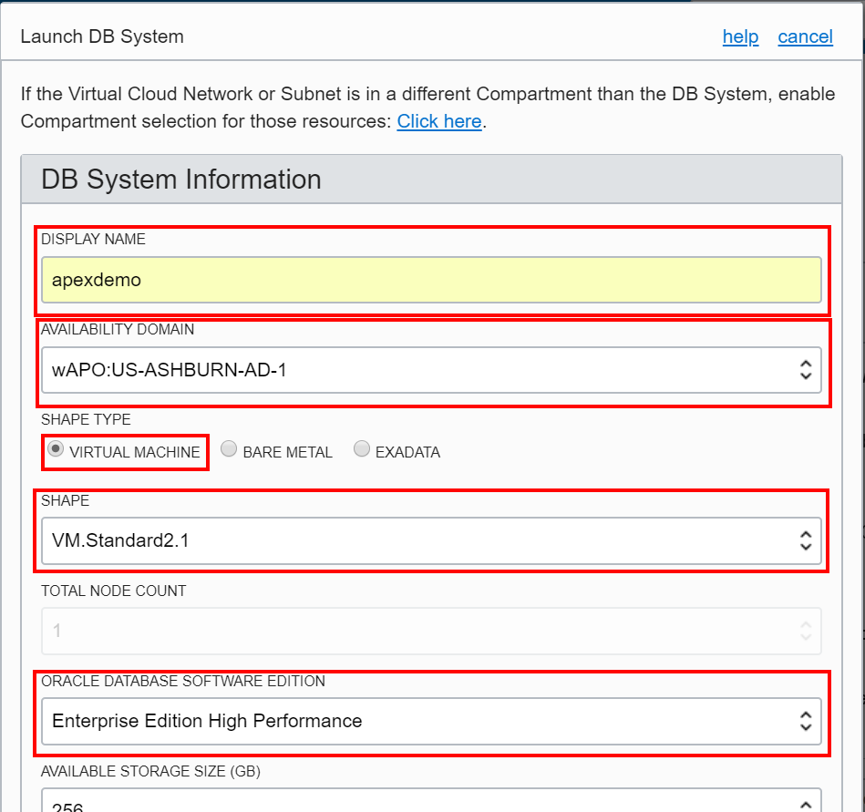
  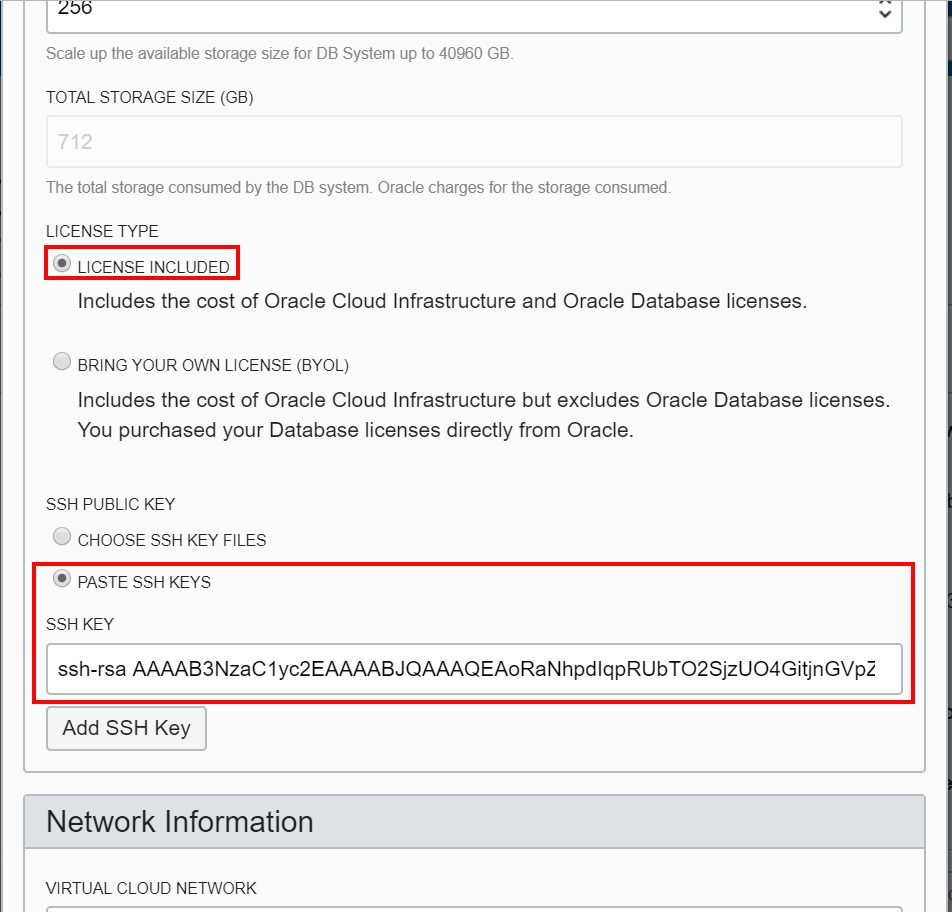
  
  
  

- The Launch DB System dialog closes. On the console, the State field indicates that the data warehouse is Provisioning. When creation is completed, the State field changes from Provisioning to Available.
- When Provisioning is completed it will show like below.

 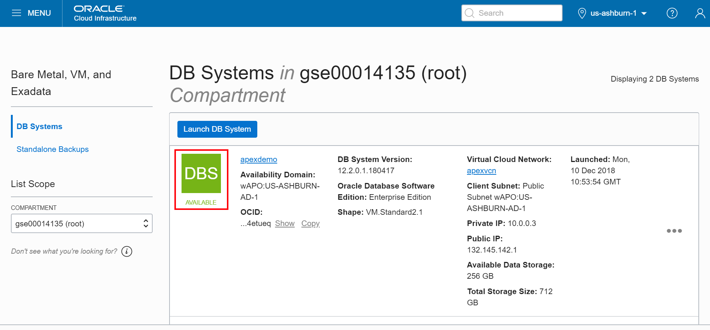

- Now login to putty with Public IP and use private key which we saved in above step.
  * Open PutTTy as below and enter DbasS public IP(Which you can see in above screen shot) as HostName.

  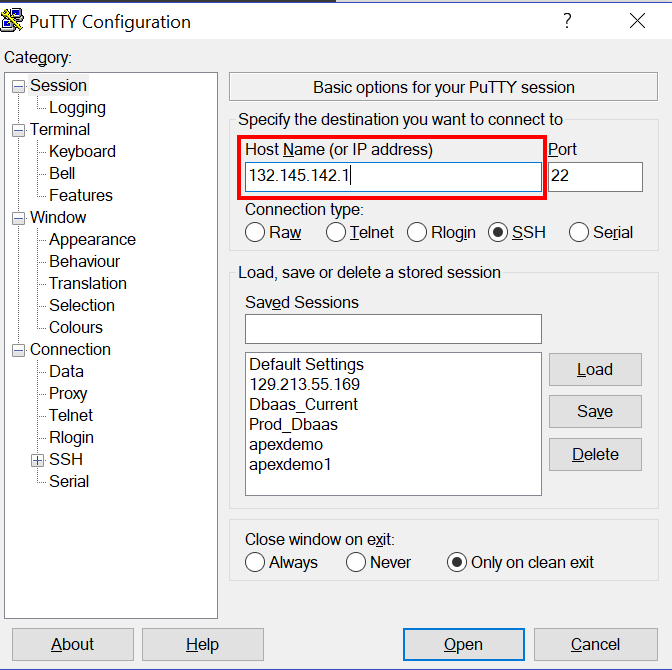

  * Now expand **connection** from left menu and click **SSH** and give path to private key which we have saved in step 6. Click **Open** button.

  

- Login as opc and then change user to oracle as shown in below screen shot.
  ```
  sudo su - oracle
  ```

  

- To check ORACLE_SID and ORACLE_HOME, Type below command
  ```
  cat /etc/oratab
  ```

 

- Add ORACLE_SID and ORACLE_HOME in .bash_profile
  * Log in as oracle user
  ```
  sudo su - oracle
  ```
  * Edit the bash profile
  ```
  vi ~/.bash_profile
  ```
  * Add below environment variable at the end of the file and save it.
    ```
    export ORACLE_SID=APEXDB
    export ORACLE_HOME=/u01/app/oracle/product/12.1.0.2/dbhome_1
    export PATH=$ORACLE_HOME/bin:$PATH
    ```
  * Save the bash_profile by pressing esc and typing wq.

  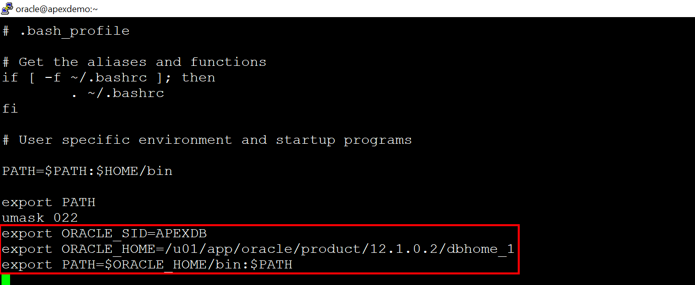
  

  * Run source command
     ```
     source ~/.bash_profile
     ```
- Now login to sqlplus using below command
  ```
  sqlplus / as sysdba
  show pdbs;
  ```

  

- Once you we see pdbs. Exit from sqlplus and install APEX and ORDS in Dbaas Instance.
## APEX and ORDS Installation in Dbaas Instance
### **STEP 6**: APEX Installation
   Approximately time 30 Minutes.
- Login to DbaaS Instance through Putty(To login in putty check Dbaas Provision Step 13 and 14).
  * Login as opc user.
  * Change user to oracle  and got to oracle home directory as below screen shot
- Download "Oracle APEX 18.2 - English language" in local machine and then copy and unzip in oracle home directory(you can use WinSCP to copy from local to cloud instance) [APEX](http://www.oracle.com/technetwork/developer-tools/apex/downloads/index.html)

 

- cd to apex directory
- Start SQL*Plus and ensure you are connecting to your PDB and not to the "root" of the container database (APEX should not be installed at all). Run Below Command to login and Wait until you see sql prompt
  ```
  sqlplus / as sysdba
  alter session set container=pdb1;
  @apexins sysaux sysaux temp /i/
  ```
  

- Unlock the APEX_PUBLIC_USER account and set the password.
  ```
  alter user apex_public_user identified by BEstrO0ng_#11 account unlock;
  ```
- Create the APEX Instance Administration user and set the password (Enter your Email id before run).
  ```
  begin
  apex_util.set_security_group_id( 10 );
  apex_util.create_user(p_user_name => 'ADMIN',p_email_address =>
  'Enter your Email id',p_web_password => 'BEstrO0ng_#11',p_developer_privs =>'ADMIN' );
  apex_util.set_security_group_id( null );
  commit;
  end;
  /
  ```
- Run APEX REST configuration, and set the passwords of APEX_REST_PUBLIC_USER and APEX_LISTENER.
  ```
  @apex_rest_config_core.sql ./ BEstrO0ng_#11 BEstrO0ng_#11
  ```
- Create a network ACE for APEX (this is used when consuming Web services or sending outbound mail).
  ```
  declare
  l_acl_path varchar2(4000);
  l_apex_schema varchar2(100);
  begin
  for c1 in (select schema from sys.dba_registry where comp_id = 'APEX') loop
  l_apex_schema := c1.schema;
  end loop;sys.dbms_network_acl_admin.append_host_ace(host => '*',ace => xs$ace_type(privilege_list => xs$name_list('connect'),principal_name => l_apex_schema,principal_type => xs_acl.ptype_db));
  commit;
  end;
  /
  ```
- Exit SQL*Plus.

### **STEP 7**: ORDS Installation

- Login to Dbaas Instance through Putty(To login in putty check Dbaas Provision Steps).
  * Login as opc user.
  * Change user to oracle  and got to oracle home directory as below screen shot
  * Create ords directory using below command.
      ```
      mkdir ords
      ```
- Download "Oracle REST Data Services" in local machine and then copy  and unzip in ords folder in oracle home directory (you can use WinSCP to copy from local to cloud instance) [ORDS](https://www.oracle.com/technetwork/developer-tools/rest-data-services/downloads/index.html)
  ```
  unzip ords-18.3.0.270.1456.zip -d /home/oracle/ords/
  ```

- Check access rule in iptables and open port for 80 and 8080.
  * login as user **opc** and become **root**
  * Run below command as root to open 80 and 8080 port
  ```
  iptables -I INPUT 8 -p tcp -m state --state NEW -m tcp --dport 8080 -j ACCEPT -m comment --comment "Required for    APEX."
  service iptables save
  iptables -t nat -I PREROUTING -p tcp --dport 80 -j REDIRECT --to-port 8080
  service iptables save
  ```

  

Note:- Please add ingress rule for your VCN to allow from public internet to 8080 and 1521.

   

- login using **oracle** and cd to the directory where you unzipped ORDS (ensure that ords.war is in your current directory).

  

- Go to params directory and replace the contents of  ords_params.properties as below.
  ```
  db.hostname=apex (Get Hostname from your Dbaas Instance)
  db.port=1521
  **Note: Change service name for your Dbaas Instance. Run “lsnrctl status” to check for pdb1 and give same as servicename**
  db.servicename=pdb1.demosubnet1.vcn1.oraclevcn.com
  db.username=APEX_PUBLIC_USER
  db.password=BEstrO0ng_#11
  migrate.apex.rest=false
  plsql.gateway.add=true
  rest.services.apex.add=true
  rest.services.ords.add=true
  schema.tablespace.default=SYSAUX
  schema.tablespace.temp=TEMP
  standalone.mode=TRUE
  standalone.http.port=8080
  standalone.use.https=false
  standalone.static.images=/home/oracle/apex/images
  user.apex.listener.password=BEstrO0ng_#11
  user.apex.restpublic.password=BEstrO0ng_#11
  user.public.password=BEstrO0ng_#11
  user.tablespace.default=SYSAUX
  user.tablespace.temp=TEMP
  ```
  
  

- Run the below command ORDS in stand-alone mode.  You'll be prompted for the SYS username and SYS password.kindly use the DBaaS Admin password as set above.
  ```
  cd /home/oracle/ords
  java -Dconfig.dir=/home/oracle/ords -jar ords.war install simple –preserveParamFile
  ```
  

- Kindly exit the session by using ctrl C and create start_ords.sh file in ords folder and put below content
  ```
  #!/bin/bash
  NOW=$(date +"%F_%H:%M")
  LOGFILE="ords-$NOW.log"
  echo
  echo "~~~~~~~~~~~~~~~~">> $LOGFILE
  echo `date` >> $LOGFILE
  echo "~~~~~~~~~~~~~~~">> $LOGFILE
  nohup java -Dconfig.dir=/home/oracle/ords -jar ords.war install simple --preserveParamFile >> $LOGFILE  2>&1  &
  echo " Check Logfile : $LOGFILE "
  echo
  ```
- Now change the permission and run the script
  ```
  chmod 777 start_ords.sh
  ./start_ords.sh
  ```
- Browse below URL to check whether ORDS is up and running.
  ```
  http://DbaaS Instance IP address:8080/ords
  ```
- Use below credentials to login.

  ```
  Workspace: INTERNAL, Username: ADMIN ,Password: BEstrO0ng_#11
  ```
  * The application will ask to change the password kindly choose the password as BEstrO0ng_#22
#### if the ADMIN password does not work reset password using below step

  

- Change your working directory to the apex directory where you unzipped the installation software. Login to sqlPlus   and run @apxchpwd. For more information refer Url.[Oracle Community](https://community.oracle.com/thread/2332882?start=0&tstart=0)
- Click sign In.

   

## ADW Scaling APEX Application Installation

### **STEP 8**: ADWC Scaling Demo Installation

- Login to Dbaas Instance through Putty(To login in putty check Dbaas Provision Step 13 and 14).
  * Login as opc user.
  * Change user to oracle  and got to oracle home directory as below screen shot
-	Set Environment variable in
  * Get Dbaas unique name by running below command
   ```
   cd  /opt/oracle/dcs/commonstore/wallets/tde
   ls -ltr
   ```

  * Copy the file name and assign ORACLE_UNQNAME in below command
  ```
  vi ~/.bash_profile
  export ORACLE_UNQNAME=**Dbaas Unique Name**
  After editing the bash_profile press esc and type wq to save.
  source ~/.bash_profile
  ```

  

- Copy ADWC wallet in oracle home directory and unzip.
  ```
  mkdir wallet_adwc
  unzip Wallet_adwapexdemo.zip -d wallet_adwc
  ```
  

- Reset the sqlnet.ora file in the APEXDB Server environment to the following. Use WALLET_LOCATION as your ADWC unzip folder name,
  ```
  cd /u01/app/oracle/product/12.1.0.2/dbhome_1/network/admin
  vi sqlnet.ora
  ```
  * Add below property in sqlnet.ora
  ```
  ENCRYPTION_WALLET_LOCATION=(SOURCE=(METHOD=FILE)(METHOD_DATA=(DIRECTORY=/opt/oracle/dcs/commonstore/wallets/tde/$ORACLE_UNQNAME)))
  SQLNET.ENCRYPTION_SERVER=REQUIRED
  SQLNET.CRYPTO_CHECKSUM_SERVER=REQUIRED
  SQLNET.ENCRYPTION_TYPES_SERVER=(AES256,AES192,AES128)
  SQLNET.CRYPTO_CHECKSUM_TYPES_SERVER=(SHA1)
  ##SQLNET.ENCRYPTION_CLIENT=REQUIRED
  ##SQLNET.CRYPTO_CHECKSUM_CLIENT=REQUIRED
  SQLNET.ENCRYPTION_TYPES_CLIENT=(AES256,AES192,AES128)
  SQLNET.CRYPTO_CHECKSUM_TYPES_CLIENT=(SHA1)
  WALLET_LOCATION = (SOURCE = (METHOD = file) (METHOD_DATA = (DIRECTORY="/home/oracle/wallet_adwc")))
  SSL_SERVER_DN_MATCH=yes
  SQLNET.WALLET_OVERRIDE=TRUE
  ##SSL_CLIENT_AUTHENTICATION = FALSE
  ##SSL_VERSION = 0
  ```

  
  

- Change **/u01/app/oracle/product/12.1.0.2/dbhome_1/network/admin/tnsnames.ora** and create entry for your Dbaas PDB that is pdb1 as below. Change host and service name, you can find service name for pdb1 by running **lsnrctl status** and host name you copy from existing entry.
  ```
  PDB1 = (DESCRIPTION = (ADDRESS = (PROTOCOL = TCP)(HOST = apexdemo.sub1018160041.hdp.oraclevcn.com)(PORT = 1521))
    (CONNECT_DATA = (SERVER = DEDICATED)(SERVICE_NAME = pdb1.sub1018160041.hdp.oraclevcn.com)))
   ```

   

- Add ADWC Wallet tnsname.ora entry in **/u01/app/oracle/product/12.1.0.2/dbhome_1/network/admin/tnsnames.ora** in addition to above step(Note: Copy only for your ADWC consumer group or you can copy all)

  

- Go to your ADWC wallet location and run below command for more information go through below link [Password Less Setup](https://docs.oracle.com/cd/B19306_01/network.102/b14266/cnctslsh.htm#g1033548)
  ```
  cd /home/oracle/wallet_adwc
  mkstore -wrl  .  -createCredential pdb1 pdbuser  BEstrO0ng_#11 (pdbuser password in Dbaas)
  mkstore -wrl  .  -createCredential adwapexdemo_high admin BEstrO0ng_#11(ADWC admin password)
  mkstore -wrl  .  -createCredential adwapexdemo_low admin BEstrO0ng_#11(ADWC admin password)
  mkstore -wrl  .  -createCredential adwapexdemo_medium admin BEstrO0ng_#11 (ADWC admin password)
  mkstore -wrl . -listCredential [password  BEstrO0ng_#11]
  ```
  

- Create link and check whether password less user is working.
  ```
  sqlplus / as sysdba
  SQL> alter session set container=pdb1;
  SQL> grant connect, resource,dba to pdbuser;
  SQL> connect /@pdb1;
  SQL> drop database link adwc;
  Note : Admin password should be same as adwcs instance admin password
  SQL> create database link adwc connect to admin identified by "BEstrO0ng_#11" using 'adwapexdemo_medium';
  SQL> alter system set global_names=FALSE scope=both sid='*';
  SQL> select * from dual@adwc;
  ```
  

- Run Dbaas schema scripts "Dbaas_Pdbuser.sql" and Adwc_Schema.sql using below command [apexdemoscript](https://github.com/cloudsolutionhubs/auto-scale-adwc/tree/master/workshops/auto-scale-adwc/apexdemoscript)
  ```
  sqlplus / as sysdba
  SQL> connect /@adwapexdemo_high;
  SQL> START /home/oracle/Adwc_Schema.sql;
  SQL> connect /@pdb1;
  SQL> START /home/oracle/Dbaas_Pdbuser.sql;
  Note : Please change below insert query and give number of OCPU which you provisioned  in ADW
  SQL> Insert into PDBUSER.VW_DBOCPU (DBPROVISIONEDOCPUS,CURRENT_OCPU,DATARETENTIONDAYS) values ("Number of OCPU provisioned in ADW",2,16);
  ```

- Download ADWCS Demo shell scripts from [scripts](https://github.com/cloudsolutionhubs/auto-scale-adwc/tree/master/workshops/auto-scale-adwc/shellscripts) and copy in oracle home directory.

   

- Open restapi.sh from scripts folder we will need the values for below fields tenancyId,authUserId,keyFingerprint,privateKeyPath, Below are the screen shots to get the value from your environment.

  * Tenancy OCID: Login to cloud environment, Click Services to show the available services. In the list of available services, select Administration ->Tenancy Details.

  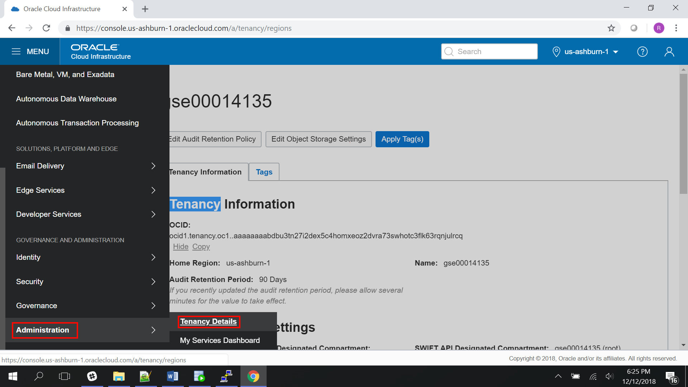
  

  * Copy Tenancy OCID in notepad.
  * AuthuserId : Login to cloud environment, Click Services to show the available services. In the list of available services, select Identity -> Users

  
  

  * Copy admin OCID in notepad as AuthuserId.
  * Login to Dbaas instance and change user as oracle and run below command to generate public key PEM file.
   ```
   mkdir ~/.oci
   openssl genrsa -out ~/.oci/oci_api_key.pem 2048
   chmod go-rwx ~/.oci/oci_api_key.pem
   openssl rsa -pubout -in ~/.oci/oci_api_key.pem -out ~/.oci/oci_api_key_public.pem
   ```
  * Open oci_api_key_public.pem file and copy the content
  * Use copied content to generate finger print for admin user
  * Click the admin user for which you had taken AuthuserID and then click Add Public Key

   

  * Paste oci_api_key_public.pem content as Public key.

  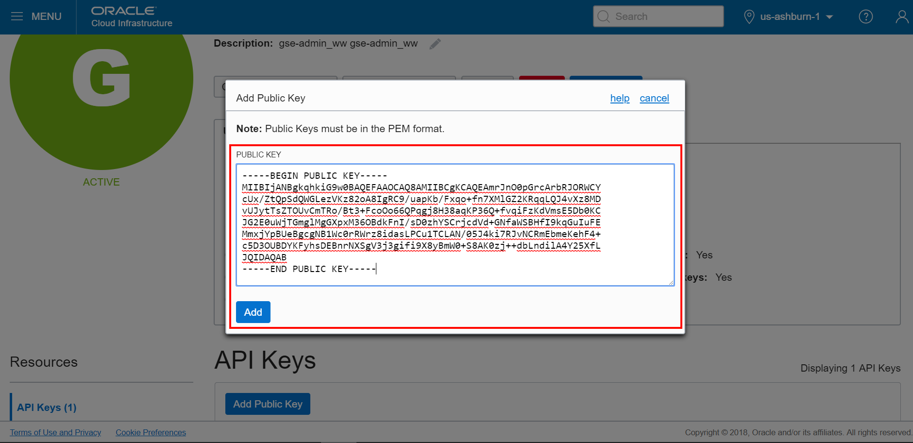

  * You can see new finger print as below

  

  * Copy new fingerprint in notepad.
  * Modify restapi.sh  and change tenancyId, authUserId, keyFingerprint, privateKeyPath(Give these value which we have noted in earlier step )

  

- Now open adwc.sh from scripts folder we will need the values for below fields ADWC OCID and Cloud host,Below are the screen shots to get the value from your environment.
  * Copy ADWC OCID in notepad.

  

  * Modify adwc.sh file and change oci-curl (Replace Cloud host and ADWC OCID as below)

  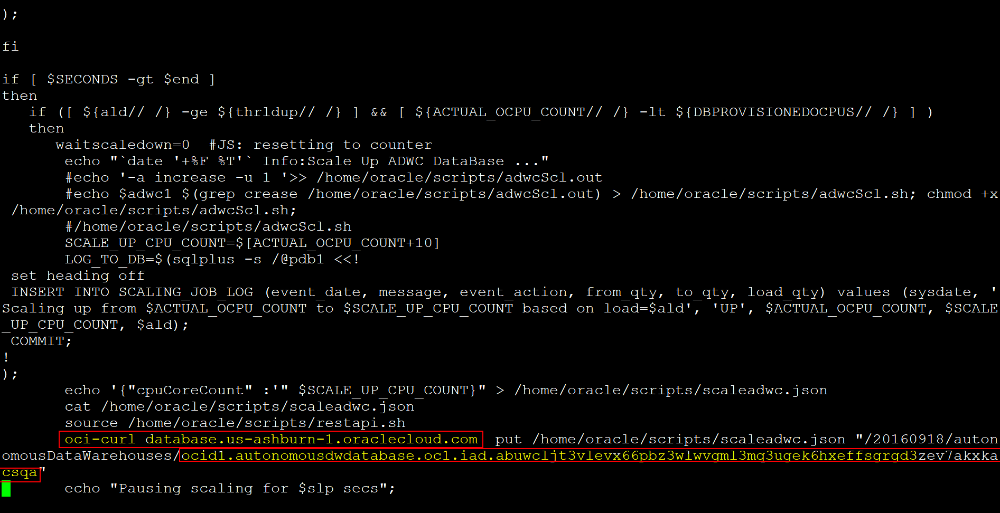
  

- Now start below scripts.
  ```
  cd /home/oracle/scripts
  ./start_adwc_load.sh
  ./ start_adwc.sh
  ```
- Login to ORDS with user same as we have in ORDS installation.
  * **http://DbaaS intance IP Address:8080/ords**

   

- Click Sign in

   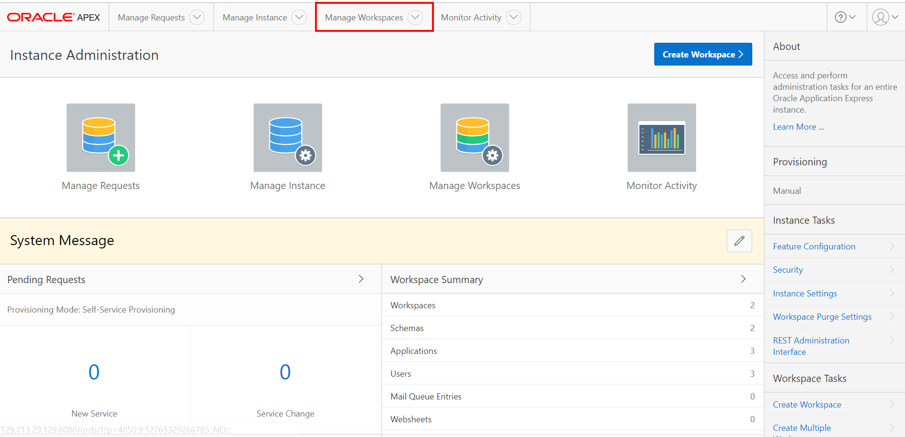

- Click Manage Workspace and select import.

   

- Download workspace "Apex_Demo_Workspace.sql" file from git [apexdemoscript](https://github.com/cloudsolutionhubs/auto-scale-adwc/tree/master/workshops/auto-scale-adwc/apexdemoscript) in local and give location

- Click next and complete import on default value

- Once you finish you will be able to see in Existing Workspace

  

-	After importing workspace logout and again login with below credential.
  * **Workspace: pdbuser, Username: APEXDEMO ,Password: apexdemo**

  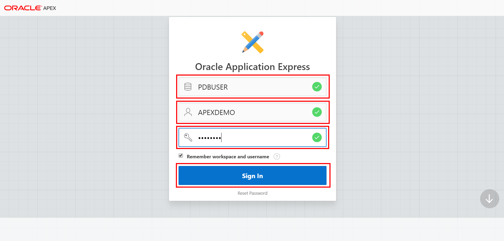

-	Click Sign In.

  

-	Click App Builder menu and select import.

  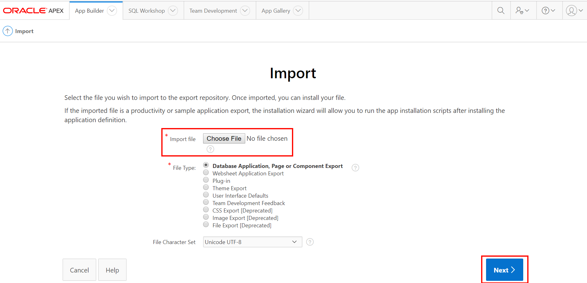

-	Download application script [apexdemoscript](apexdemoscript/Apex_Demo_Application.sql) in local and give location in Choose file.

-	Click Next and finish application deployment.

-	Once you finish you can run application

  
